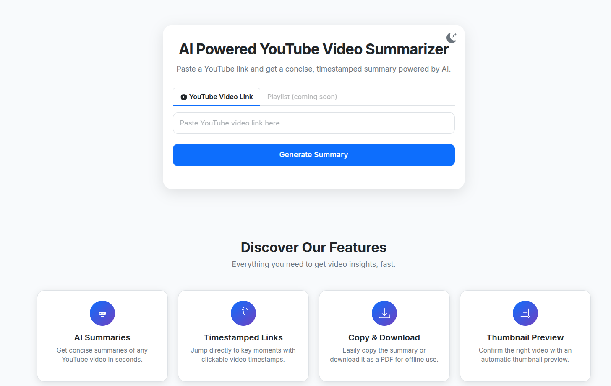
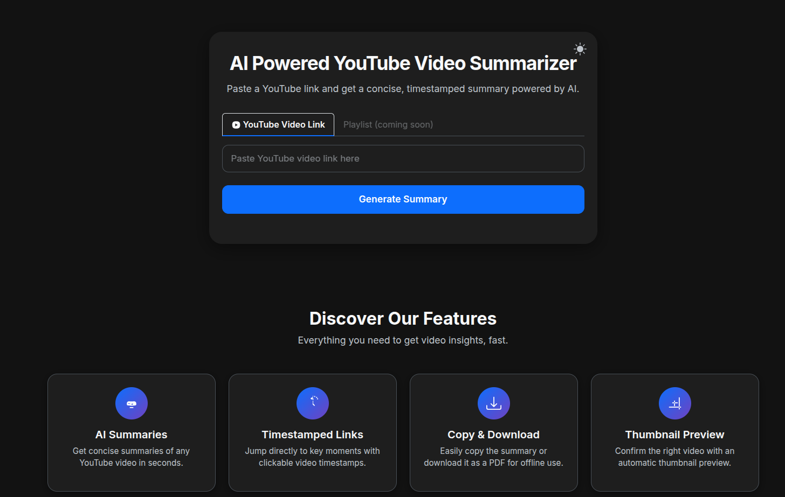

# AI Powered YouTube Video Summarizer

A modern, full-stack web app to generate concise, timestamped summaries of YouTube videos using AI (Google Gemini/GenAI). Paste a YouTube link and get a beautiful summary with clickable video breakpoints, thumbnail preview, and export options—all in a sleek, dark-mode-friendly UI.
---

## Features

- **AI Summaries**: Get concise, high-quality summaries of any YouTube video in seconds.
- **Timestamped Links**: Jump directly to key moments with clickable video timestamps after each summary paragraph.
- **Thumbnail Preview**: Instantly see the video thumbnail for confirmation.
- **Copy & Download**: Copy the summary to clipboard or download it as a PDF (with formatting preserved).
- **Dark Mode**: Toggle between light and dark themes for comfortable viewing.
- **Responsive Design**: Looks great on desktop and mobile.

---

## Tech Stack
- **Backend**: Django, youtube-transcript-api, Google Generative AI (Gemini)
- **Frontend**: Bootstrap 5, Vanilla JS, html2pdf.js

---

## Getting Started

### 1. Clone the repository
```bash
git clone https://github.com/adityasuthar/youtube-transcript-summarizer.git
cd YOUR-REPO-NAME
```

### 2. Create and activate a virtual environment
```bash
python3 -m venv venv
source venv/bin/activate
```

### 3. Install dependencies
```bash
pip install -r requirements.txt
```

### 4. Set your Google GenAI API key
Create .env file and GENAI_API_KEY=YOUR_GOOGLE_GENAI_API_KEY
replace `YOUR_GOOGLE_GENAI_API_KEY` with your actual API key.

### 5. Run migrations
```bash
python manage.py migrate
```

### 6. Start the development server
```bash
python manage.py runserver
```

Visit [http://127.0.0.1:8000/](http://127.0.0.1:8000/) in your browser.

---

## Screenshots

> Add your own screenshots here! Example:
>
> 
> 

---

## Key Features (for Users)
- Paste a YouTube link and click **Generate Summary**
- See the video thumbnail and a clear, point-wise summary
- Click timestamp links to jump to key moments in the video
- Copy or download the summary as a PDF
- Switch between light and dark mode

---

## License
This project is open source and available under the [MIT License](LICENSE).

---

## Credits
- [Bootstrap](https://getbootstrap.com/)
- [html2pdf.js](https://github.com/eKoopmans/html2pdf.js)
- [Google Generative AI](https://ai.google.dev/)
- [youtube-transcript-api](https://github.com/jdepoix/youtube-transcript-api)

---

## Future Ideas
- Playlist summarization
- User authentication and history
- More export/share options
- Multi-language support

---

> Made with ❤️ for fast, AI-powered video learning. 